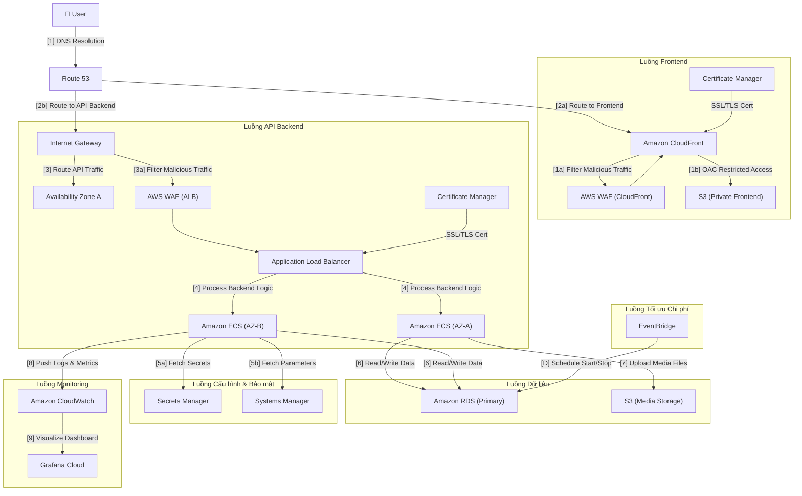
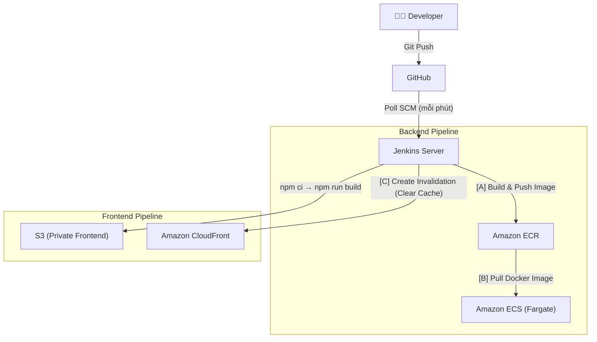

# 📋 TỔNG QUAN DỰ ÁN — MINI SOCIAL NETWORK

> **Phiên bản tài liệu:** 1.0 | **Cập nhật:** 01/07/2026  
> **Tác giả:** PHT (pht1412) | **Trạng thái:** Đang vận hành Production  
> **URL Production:** [https://minisocial-network.id.vn](https://minisocial-network.id.vn)

---

## 1. THÔNG TIN TỔNG QUAN & VẤN ĐỀ (Executive Summary & Problem Statement)

### 1.1. Tên dự án

**Mini Social Network** (MiniSocial) — Nền tảng mạng xã hội thu nhỏ tích hợp gamification.

### 1.2. Bối cảnh / Vấn đề hiện tại

| Hạng mục | Mô tả |
|---|---|
| **Bài toán** | Xây dựng một nền tảng mạng xã hội fullstack hoàn chỉnh từ **thiết kế → phát triển → triển khai production trên AWS** — phục vụ như dự án thực chiến học thuật (HUTECH) chứng minh năng lực DevOps & Cloud Engineering. |
| **Đối tượng sử dụng** | Sinh viên, giảng viên và cộng đồng nhỏ muốn tương tác xã hội (đăng bài, chat, chơi game, gacha vật phẩm trang trí). |
| **Phạm vi** | Hệ thống phục vụ từ 20–100 người dùng đồng thời (concurrent users), có khả năng scale lên nhờ kiến trúc Cloud-native. |
| **Nhu cầu thực tế** | Cần một sản phẩm thực tế để: (1) Chứng minh kiến thức Cloud/DevOps, (2) Thực hành CI/CD end-to-end, (3) Áp dụng các best practices về bảo mật, monitoring và tối ưu chi phí trên AWS. |

### 1.3. Giải pháp cốt lõi & Lợi ích

| Giải pháp | Chi tiết |
|---|---|
| **Kiến trúc Cloud-Native** | Toàn bộ hệ thống triển khai trên AWS với **Infrastructure as Code (CloudFormation)**, container hóa bằng Docker, chạy trên ECS Fargate (Serverless Compute). |
| **CI/CD tự động hoàn toàn** | Jenkins Pipeline tự động: Test → Build Docker → Push ECR → Deploy ECS (Backend) và Build → Sync S3 → Invalidate CloudFront (Frontend). |
| **Tối ưu chi phí** | Auto Scheduling tắt/bật hạ tầng theo giờ (ECS + RDS ngủ 10PM, dậy 7AM), Fargate Spot giảm ~70% chi phí compute. |
| **Bảo mật Enterprise** | JWT Authentication, AWS WAF, SSL/TLS everywhere, Secrets quản lý qua SSM Parameter Store, Private Subnet cho Backend & Database. |

**ROI & Điểm hòa vốn:**  
- Đây là dự án học thuật/portfolio, không tính ROI tài chính trực tiếp.  
- **Giá trị đầu ra:** Chứng minh năng lực triển khai production-grade system trên AWS, portfolio DevOps mạnh mẽ.
- **Chi phí vận hành ước tính:** ~$30–50 USD/tháng nhờ tối ưu scheduling + Fargate Spot + Free Tier RDS.

---

## 2. KIẾN TRÚC GIẢI PHÁP & TRIỂN KHAI (Solution Architecture & Implementation)

### 2.1. Tech Stack

```
┌─────────────────────────────────────────────────────────────────┐
│                        TECH STACK                               │
├─────────────────┬───────────────────────────────────────────────┤
│ Layer           │ Công nghệ                                     │
├─────────────────┼───────────────────────────────────────────────┤
│ Frontend        │ React 19 + TypeScript 5.9                     │
│ Build Tool      │ Vite (Rolldown) + React Compiler              │
│ UI Framework    │ MUI (Material UI) 7.x + Emotion               │
│ State/Routing   │ React Router DOM 7.x + Context API            │
│ Realtime        │ STOMP.js + SockJS (WebSocket)                  │
│ HTTP Client     │ Axios                                         │
├─────────────────┼───────────────────────────────────────────────┤
│ Backend         │ Spring Boot 3.2.6 (Java 17)                   │
│ ORM             │ Spring Data JPA + Hibernate                   │
│ Auth            │ Spring Security + JWT (jjwt 0.11.5)           │
│ API Docs        │ SpringDoc OpenAPI (Swagger UI)                │
│ Email           │ Spring Boot Mail (Gmail SMTP)                 │
│ WebSocket       │ Spring WebSocket (STOMP)                      │
│ Storage         │ AWS S3 SDK (local fallback)                   │
│ Monitoring      │ Micrometer OTLP → Grafana Cloud               │
│ Testing         │ JUnit 5 + JaCoCo (≥70% coverage)             │
│                 │ Selenium + WebDriverManager (E2E)             │
│ Code Quality    │ Lombok + Maven Compiler Plugin                │
├─────────────────┼───────────────────────────────────────────────┤
│ Database        │ Microsoft SQL Server 2022 (Express)           │
│ Cloud DB        │ Amazon RDS for SQL Server (db.t3.small)       │
│ Local DB        │ Docker (mcr.microsoft.com/mssql/server)       │
├─────────────────┼───────────────────────────────────────────────┤
│ Cloud (AWS)     │ VPC, ECS Fargate, ECR, RDS, S3, CloudFront   │
│                 │ ALB, Route 53, ACM, WAF, CloudWatch           │
│                 │ SSM Parameter Store, NAT Gateway              │
│                 │ EventBridge Scheduler, IAM                    │
│ IaC             │ AWS CloudFormation (4 Stack files)            │
│ CI/CD           │ Jenkins (2 Pipelines: Backend + Frontend)     │
│ Monitoring      │ Grafana Cloud (OTLP Metrics)                  │
│ Containerize    │ Docker + Docker Compose                       │
│ Load Testing    │ K6 (Grafana)                                  │
│ Version Control │ Git + GitHub                                  │
└─────────────────┴───────────────────────────────────────────────┘
```

### 2.2. Sơ đồ kiến trúc (Architecture Diagrams)

> **File sơ đồ gốc:**  
> 📄 [`MiniSocial-Architect_final.txt`](file:///c:/Users/lhp14/Mini-social-network/AWS_IAC/MiniSocial-Architect_final.txt) (draw.io XML)  
> 🖼️ [`Minisocial.png`](file:///c:/Users/lhp14/Mini-social-network/AWS_IAC/Minisocial.png) (Sơ đồ kiến trúc chính thức)

---

#### 📐 PHÂN TÍCH CHI TIẾT TOÀN BỘ LUỒNG ĐI CỦA SƠ ĐỒ KIẾN TRÚC

Sơ đồ kiến trúc được chia thành **4 vùng chính** và **2 luồng dữ liệu** (User Traffic + CI/CD Pipeline):

---

##### 🔷 VÙNG 1: External (Bên ngoài AWS Cloud)

| Thành phần | Vị trí | Vai trò |
|---|---|---|
| **👤 User** | Bên ngoài AWS | Người dùng cuối truy cập web app |
| **Grafana Cloud** | Management & CI/CD Pipeline (External SaaS) | Dashboard trực quan hóa metrics |
| **Jenkins Server** | Management & CI/CD Pipeline (External SaaS) | CI/CD server chạy trên máy local |

---

##### 🔷 VÙNG 2: AWS Global Services (Bên ngoài VPC, trong AWS Cloud)

| Thành phần | Vai trò |
|---|---|
| **Route 53** | DNS Service — Phân giải tên miền |
| **CloudFront** | CDN — Phân phối nội dung frontend toàn cầu |
| **AWS WAF** (ngoài VPC) | Tường lửa ứng dụng web cho CloudFront |
| **Certificate Manager** (trên) | Chứng chỉ SSL/TLS cho CloudFront |
| **S3 (Private Frontend)** | Lưu trữ file tĩnh React (HTML/CSS/JS) — 100% Private |
| **S3 (Media Storage)** | Lưu trữ ảnh/video do người dùng upload |

---

##### 🔷 VÙNG 3: AWS Region → VPC (10.0.0.0/16)

**Bao gồm các thành phần bên trong VPC:**

| Thành phần | Subnet | Vai trò |
|---|---|---|
| **Internet Gateway** | VPC Level | Cửa ngõ ra/vào Internet cho VPC |
| **AWS WAF** (trong VPC) | VPC Level | Tường lửa ứng dụng web cho ALB |
| **Application Load Balancer** | Public Subnet A + B | Cân bằng tải HTTP/HTTPS, sticky session |
| **Amazon ECS** (AZ-A) | Public Subnet A | Fargate Task chạy Spring Boot container |
| **Amazon ECS** (AZ-B) | Public Subnet B | Fargate Task chạy Spring Boot container (Multi-AZ) |
| **Amazon RDS (Primary)** | Private subnet-data A | SQL Server database chính |
| **Certificate Manager** (trong Region) | AWS Region | Chứng chỉ SSL/TLS cho ALB |
| **Amazon CloudWatch** | AWS Region | Thu thập logs & metrics từ ECS |
| **Amazon ECR** | AWS Region | Docker image registry |
| **Systems Manager** | AWS Region | Parameter Store cho cấu hình không nhạy cảm |
| **Secrets Manager** | AWS Region | Quản lý secrets nhạy cảm (DB password, JWT secret...) |
| **EventBridge** | AWS Region | Scheduler tự động tắt/bật RDS (Cost Optimization) |

> **Lưu ý từ sơ đồ:** Sơ đồ thể hiện 2 **Private subnet-data** (A & B) ở tầng dưới cùng, trong đó **Private subnet-data A** chứa RDS Primary, **Private subnet-data B** hiện đang trống (dự phòng cho Multi-AZ RDS trong tương lai).

---

##### 🔷 VÙNG 4: Management & CI/CD Pipeline (External Services)

| Thành phần | Vai trò |
|---|---|
| **Grafana Cloud** | SaaS bên ngoài — Visualize metrics/dashboard |
| **Jenkins Server** | CI/CD server bên ngoài — Build, Test, Deploy |

---

#### 🔄 LUỒNG 1: USER REQUEST FLOW (Luồng truy cập của người dùng)



##### Mô tả chi tiết từng bước theo đúng nhãn trên sơ đồ:

| Bước | Nhãn trên sơ đồ | Mô tả chi tiết |
|---|---|---|
| **[1]** | `DNS Resolution` | User gõ URL → **Route 53** phân giải tên miền `minisocial-network.id.vn` thành IP/CNAME tương ứng. |
| **[1a]** | `Filter Malicious Traffic` | **AWS WAF** (gắn với CloudFront) lọc request độc hại (SQL Injection, XSS, Bot...) trước khi đến CloudFront. |
| **[1b]** | `OAC Restricted Access` | **CloudFront** dùng **Origin Access Control (OAC)** để truy cập S3 Private Frontend — S3 Bucket hoàn toàn chặn public, chỉ CloudFront mới đọc được file. |
| **[2]** | `API Requests` | User gửi API requests (gọi backend) → Đi trực tiếp qua **Internet Gateway** vào VPC. |
| **[2a]** | `Route to Frontend` | Route 53 định tuyến request frontend (domain chính) đến **CloudFront Distribution**. |
| **[2b]** | `Route to API Backend` | Route 53 định tuyến request API (`api.minisocial-network.id.vn`) qua **Internet Gateway** vào VPC. |
| **[3]** | `Route API Traffic` | **Internet Gateway** chuyển tiếp API traffic vào bên trong **VPC** → đến Public Subnet chứa ALB. |
| **[3a]** | `Filter Malicious Traffic` | **AWS WAF** (gắn với ALB) lọc traffic API độc hại trước khi đến Application Load Balancer. |
| **[4]** | `Process Backend Logic` | **ALB** phân phối request đến **2 Amazon ECS Fargate Tasks** đang chạy ở 2 AZ khác nhau (AZ-A trong Public Subnet A, AZ-B trong Public Subnet B). Sử dụng **sticky session** (lb_cookie) để duy trì phiên WebSocket. |
| **[5a]** | `Fetch Secrets` | ECS Tasks khởi động → Kéo **secrets nhạy cảm** (DB password, JWT secret, AWS keys, Grafana token, Mail password) từ **Secrets Manager**. |
| **[5b]** | `Fetch Parameters` | ECS Tasks kéo **cấu hình không nhạy cảm** (environment variables) từ **Systems Manager Parameter Store**. |
| **[6]** | `Read / Write Data` | Cả 2 ECS Tasks đều kết nối đến **Amazon RDS SQL Server (Primary)** trong **Private subnet-data A** để đọc/ghi dữ liệu. Kết nối sử dụng JDBC qua Private Subnet, không đi qua Internet. |
| **[7]** | `Upload Media Files` | Khi user upload ảnh/video → ECS Task xử lý và lưu file lên **Amazon S3 (Media Storage)** thông qua **S3 VPC Gateway Endpoint** (bypass NAT Gateway, tiết kiệm chi phí). |
| **[8]** | `Push Logs & Metrics` | ECS Tasks tự động đẩy **application logs** và **performance metrics** lên **Amazon CloudWatch** (Log Group: `/ecs/minisocial-backend`, retention 7 ngày). |
| **[9]** | `Visualize Dashboard` | CloudWatch chuyển tiếp metrics qua **OTLP protocol** → **Grafana Cloud** để visualize dashboard monitoring real-time. |
| **SSL/TLS Cert** | `Certificate Manager → CloudFront` | **ACM** cấp chứng chỉ SSL/TLS cho CloudFront (phải tạo ở `us-east-1`). |
| **SSL/TLS Cert** | `Certificate Manager → ALB` | **ACM** cấp chứng chỉ SSL/TLS cho ALB Listener HTTPS (port 443) trong VPC Region. |

---

#### 🔄 LUỒNG 2: CI/CD PIPELINE FLOW (Luồng triển khai tự động)



##### Mô tả chi tiết từng bước CI/CD:

| Bước | Nhãn trên sơ đồ | Mô tả chi tiết |
|---|---|---|
| **[A]** | `Build & Push Image` | Jenkins build Docker image cho Backend → Tag với `v${BUILD_NUMBER}` + `latest` → Push lên **Amazon ECR**. |
| **[B]** | `Pull Docker Image` | **ECS Fargate Tasks** pull Docker image mới nhất từ **ECR** khi Service được update (force new deployment). |
| **[C]** | `Create Invalidation (Clear Cache)` | Jenkins gọi **CloudFront API** để tạo cache invalidation (`/*`) → User sẽ thấy giao diện mới ngay lập tức thay vì cache cũ. |
| **[D]** | `Schedule Start/Stop (Cost Optimization)` | **EventBridge Scheduler** tự động gọi AWS SDK để tắt RDS lúc 10PM và bật lại lúc 7AM hàng ngày (múi giờ Việt Nam), tiết kiệm ~37.5% chi phí chạy DB. |

---

#### 🏗️ BỐ CỤC MẠNG (Network Layout) — Theo đúng sơ đồ

```
AWS Cloud
├── 🌐 Global Services (Ngoài VPC)
│   ├── Route 53 (DNS)
│   ├── CloudFront (CDN) ← SSL/TLS ← Certificate Manager
│   ├── AWS WAF (CloudFront)
│   ├── S3 (Private Frontend) ← OAC ← CloudFront
│   └── S3 (Media Storage) ← VPC Gateway Endpoint
│
├── 🔧 Management & CI/CD Pipeline (External SaaS)
│   ├── Grafana Cloud ← CloudWatch [9]
│   └── Jenkins Server → ECR [A], CloudFront [C]
│
└── 📦 AWS Region (ap-southeast-1)
    ├── Certificate Manager (ALB SSL/TLS)
    ├── Amazon CloudWatch (Logs & Metrics)
    ├── Amazon ECR (Docker Registry)
    ├── Systems Manager (Parameter Store)
    ├── Secrets Manager (Sensitive Secrets)
    ├── EventBridge (Scheduler)
    │
    └── VPC (10.0.0.0/16)
        ├── Internet Gateway
        ├── AWS WAF (ALB)
        │
        ├── Availability Zone A
        │   ├── 🟢 Public Subnet A (10.0.1.0/24)
        │   │   └── Amazon ECS (Fargate Task #1)
        │   └── 🔵 Private subnet-data A (10.0.3.0/24)
        │       └── Amazon RDS SQL Server (Primary)
        │
        ├── Availability Zone B
        │   ├── 🟢 Public Subnet B (10.0.2.0/24)
        │   │   └── Amazon ECS (Fargate Task #2)
        │   └── 🔵 Private subnet-data B (10.0.4.0/24)
        │       └── (Dự phòng — Multi-AZ RDS tương lai)
        │
        └── Application Load Balancer
            └── Spanning: Public Subnet A + Public Subnet B
```

> **Điểm khác biệt so với bản sơ đồ cũ:**
> - Sơ đồ mới thể hiện **ECS Tasks nằm trong Public Subnet** (chứ không phải Private Subnet Compute riêng).
> - Có thêm **Secrets Manager** tách riêng khỏi Systems Manager — quản lý secrets nhạy cảm chuyên biệt.
> - **Private subnet-data** được chia thành **A** và **B** ở 2 AZ, chuẩn bị cho Multi-AZ RDS.
> - NAT Gateway không còn hiển thị rõ trên sơ đồ mới (đã implicit trong Public Subnet A).

### 2.4. Phần cứng / Thiết bị Edge

> ❌ **Không có** — Dự án hoàn toàn Cloud-based, không sử dụng thiết bị IoT hay phần cứng ngoại vi.

- **Jenkins Server:** Chạy trên máy local (Windows) làm CI/CD server bên ngoài AWS.
- **Development:** Windows local machine.

### 2.5. Cấu trúc mã nguồn (Source Code Structure)

#### Backend (Spring Boot — 28 packages nghiệp vụ):

| Package | Chức năng |
|---|---|
| `User` | Quản lý người dùng, profile, avatar |
| `Security` | JWT Authentication, SecurityHistory, Password Reset |
| `Post` / `PostMedia` / `PostReaction` | Bài đăng, media đính kèm, reactions (like/love/haha...) |
| `Comment` | Bình luận bài đăng |
| `Chat` / `Message` / `Conversation` | Hệ thống nhắn tin realtime (WebSocket STOMP) |
| `FriendRequest` | Kết bạn, lời mời kết bạn |
| `Notification` | Hệ thống thông báo |
| `Moderation` | Kiểm duyệt nội dung (Blacklisted words) |
| `Gacha` | Hệ thống quay vật phẩm (Gacha/Lootbox) |
| `Item` | Vật phẩm trang trí (Avatar Frame, Name Color) |
| `Game` | Mini-games (Snake, Tic-Tac-Toe) |
| `VPTLpoint` | Hệ thống điểm thưởng |
| `Presence` | Trạng thái online/offline |
| `Storage` | Abstraction layer (Local ↔ AWS S3) |
| `Admin` | Panel quản trị |
| `HealthCheck` | API health monitoring |
| `Config` | CORS, Security, WebSocket, Swagger config |

#### Frontend (React — Chức năng chính):

| Module | Chức năng |
|---|---|
| `pages/auth` | Login, Register, Reset Password |
| `pages/HomePage` | News Feed (Bảng tin chính) |
| `pages/ProfilePage` | Trang cá nhân |
| `pages/ShopPage` | Cửa hàng vật phẩm |
| `pages/GameList` | Danh sách mini-games |
| `pages/admin` | Admin Dashboard, User/Post/Blacklist Manager |
| `components/chat` | Chat realtime |
| `components/messenger` | Nhắn tin cá nhân |
| `components/gacha` | Quay vật phẩm (GachaBox, Spin, Reveal) |
| `components/game` | Snake Game, Tic-Tac-Toe |
| `components/Cosmetic` | Hiệu ứng trang trí (Avatar Frame, Name Color) |
| `components/banner` | Event Banner hệ thống |
| `styles/cosmetics` | CSS effects (Cyber, Galaxy, Fire, Ocean...) |

### 2.6. CloudFormation Stacks (IaC — 4 Stack Files)

| Stack | File | Mô tả |
|---|---|---|
| **Stack 1 — Network** | [final-minisocial-architect.yaml](file:///c:/Users/lhp14/Mini-social-network/AWS_IAC/final-minisocial-architect.yaml) | VPC, Subnets, IGW, NAT GW, ALB, Security Groups, ECS Cluster, S3 VPC Endpoint |
| **Stack 2 — Database** | [final-minisocial-db.yaml](file:///c:/Users/lhp14/Mini-social-network/AWS_IAC/final-minisocial-db.yaml) | RDS SQL Server, DB Security Group, EventBridge Scheduler (tự động tắt/bật DB) |
| **Stack 3 — Backend** | [final-minisocial-backend.yaml](file:///c:/Users/lhp14/Mini-social-network/AWS_IAC/final-minisocial-backend.yaml) | ECS Fargate Service, Task Definition, IAM Roles, SSM Secrets, Auto Scaling Schedule |
| **Stack 4 — Frontend** | [final-minisocial-frontend+cloudfront.yaml](file:///c:/Users/lhp14/Mini-social-network/AWS_IAC/final-minisocial-frontend+cloudfront.yaml) | S3 Bucket (Private), CloudFront Distribution, OAC, Custom Domain SSL |

### 2.7. Các giai đoạn triển khai (Implementation Phases)

#### Phase 1 — Nền tảng cơ bản (Foundation)
- ✅ Thiết kế Database Schema (MSSQL)
- ✅ Backend REST API: Auth (JWT), CRUD Posts, Comments, Users
- ✅ Frontend SPA: Login/Register, News Feed, Profile
- ✅ Docker Compose cho local development

#### Phase 2 — Tính năng xã hội (Social Features)
- ✅ Hệ thống kết bạn (Friend Requests)
- ✅ Chat realtime (WebSocket STOMP)
- ✅ Messenger (Conversations)
- ✅ Notifications
- ✅ Post Reactions (Like, Love, Haha, Wow, Sad, Angry)
- ✅ Content Moderation (Blacklisted words)

#### Phase 3 — Gamification & Cosmetics
- ✅ Hệ thống điểm (VPTL Points)
- ✅ Cửa hàng vật phẩm (Shop)
- ✅ Gacha / Lootbox system
- ✅ Cosmetic items: Avatar Frames (Snake, Magma, Galaxy, Cyber, Hologram) + Name Colors (Neon, Golden, Ocean, Blood Moon, Matrix)
- ✅ Mini-games: Snake, Tic-Tac-Toe

#### Phase 4 — Cloud Deployment & DevOps (Enterprise Grade)
- ✅ AWS Infrastructure as Code (4 CloudFormation stacks)
- ✅ VPC Multi-AZ architecture
- ✅ ECS Fargate (Serverless containers) + Fargate Spot
- ✅ RDS SQL Server (Private Subnet, Encrypted, Auto-backup 7 ngày)
- ✅ S3 + CloudFront (OAC) cho Frontend hosting
- ✅ ALB + HTTPS + ACM Certificate
- ✅ AWS WAF bảo vệ DDoS/Injection
- ✅ Route 53 Custom Domain
- ✅ Jenkins CI/CD Pipelines (Backend + Frontend)
- ✅ SSM Parameter Store quản lý Secrets
- ✅ EventBridge Scheduler tối ưu chi phí

#### Phase 5 — Monitoring & Load Testing
- ✅ Grafana Cloud (Metrics via Micrometer OTLP)
- ✅ CloudWatch Logs
- ✅ K6 Load Testing (Normal flow, DDoS flow, Feed/Like tests)
- ✅ JaCoCo Code Coverage (≥70%)
- ✅ Selenium E2E Testing

---

## 3. THỜI GIAN & NGÂN SÁCH (Timeline & Budget)

### 3.1. Tiến độ (Timeline)

> ⚠️ *Thông tin dưới đây được suy luận từ mã nguồn và commit history. Vui lòng điều chỉnh nếu cần.*

| Giai đoạn | Thời gian ước tính | Cột mốc (Milestone) |
|---|---|---|
| Phase 1 — Foundation | ~4-6 tuần | MVP: Auth + CRUD + Docker local |
| Phase 2 — Social | ~3-4 tuần | Realtime Chat, Friends, Notifications |
| Phase 3 — Gamification | ~2-3 tuần | Gacha, Shop, Mini-games, Cosmetics |
| Phase 4 — Cloud & DevOps | ~4-6 tuần | AWS Production Live + CI/CD |
| Phase 5 — Monitoring | ~1-2 tuần | Grafana, K6, Coverage reports |
| **Tổng ước tính** | **~14-21 tuần** | **Production Ready** |

### 3.2. Ngân sách (Budget)

#### Chi phí hạ tầng AWS (ước tính hàng tháng):

| Dịch vụ AWS | Cấu hình | Chi phí/tháng (USD) |
|---|---|---|
| **ECS Fargate** | 2 tasks × 0.5 vCPU / 1GB RAM (15h/ngày) | ~$15–20 |
| **Fargate Spot** | 1 task Spot (giảm ~70%) | ~$3–5 |
| **RDS SQL Server Express** | db.t3.small, 20GB gp2 (15h/ngày) | ~$10–15 |
| **NAT Gateway** | 1 NAT GW + data transfer | ~$5–8 |
| **S3** | Frontend static + Media uploads | ~$1–2 |
| **CloudFront** | CDN distribution | ~$0–1 (Free Tier) |
| **ALB** | Application Load Balancer | ~$5 |
| **Route 53** | Hosted Zone + DNS queries | ~$0.50 |
| **ACM** | SSL/TLS Certificates | **Miễn phí** |
| **CloudWatch** | Logs + Metrics | ~$1–2 |
| **ECR** | Docker image storage | ~$0–1 |
| **WAF** | Web ACL | ~$5 |
| **SSM Parameter Store** | Standard tier | **Miễn phí** |
| **EventBridge Scheduler** | 2 schedules | **Miễn phí** |
| **Tổng ước tính** | | **~$45–60/tháng** |

> 💡 **Tối ưu chi phí đã áp dụng:**
> - Auto Scheduling tắt RDS + ECS từ 22:00 → 07:00 hàng ngày (tiết kiệm ~37.5% thời gian chạy)
> - Fargate Spot cho 1/2 tasks (tiết kiệm ~70% compute cho task đó)
> - S3 VPC Gateway Endpoint (bypass NAT Gateway cho S3 traffic → tiết kiệm data transfer)
> - RDS DeletionPolicy: Snapshot (bảo vệ dữ liệu nếu xóa stack)

#### Chi phí khác:

| Hạng mục | Chi phí |
|---|---|
| **Domain** (minisocial-network.id.vn) | ~$5–10/năm |
| **Jenkins Server** | $0 (chạy local Windows) |
| **Grafana Cloud** | $0 (Free Tier) |
| **GitHub** | $0 (Free Tier) |

---

## 4. RỦI RO & KẾT QUẢ KỲ VỌNG (Risk & Outcomes)

### 4.1. Ma trận rủi ro (Risk Matrix)

| # | Rủi ro | Mức độ | Xác suất | Tác động | Phương án dự phòng |
|---|---|---|---|---|---|
| **R1** | **Fargate Spot bị thu hồi (Reclaimed)** | 🟡 Trung bình | Trung bình | Service gián đoạn tạm thời | ✅ **Đã xử lý:** Luôn có 1 task On-demand (Base=1) không bao giờ bị thu hồi. Task Spot chỉ là bổ sung. ALB tự động route traffic sang task còn lại. |
| **R2** | **Chi phí AWS vượt budget (Bill Shock)** | 🔴 Cao | Thấp | Tài chính phát sinh | ✅ **Đã xử lý:** Auto Scheduling tắt 10PM–7AM, Fargate Spot, S3 VPC Endpoint. **Cần thêm:** Thiết lập AWS Budgets alarm. |
| **R3** | **Database Single-AZ bị sự cố** | 🔴 Cao | Thấp | Mất dữ liệu, downtime | ✅ **Đã xử lý một phần:** Auto-backup 7 ngày, DeletionPolicy Snapshot, StorageEncrypted. **Hạn chế:** RDS Express Edition không hỗ trợ Multi-AZ. Cần upgrade lên Standard nếu muốn HA. |
| **R4** | **Jenkins Server local bị hỏng** | 🟡 Trung bình | Trung bình | CI/CD pipeline ngừng hoạt động | ⚠️ **Chưa xử lý:** Jenkins chạy local, chưa có backup config. **Khuyến nghị:** Migrate Jenkins lên EC2 hoặc sử dụng GitHub Actions. |
| **R5** | **Bảo mật: Lộ credentials / API keys** | 🔴 Cao | Thấp | Bị tấn công, mất dữ liệu | ✅ **Đã xử lý:** SSM Parameter Store cho secrets, WAF bảo vệ, Private Subnet cho Backend/DB, HTTPS everywhere, JWT token rotation. |

### 4.2. Kết quả đầu ra & Giá trị cốt lõi

#### Sản phẩm giao付 (Deliverables):

| # | Kết quả | Trạng thái |
|---|---|---|
| 1 | **Web Application** hoàn chỉnh (Frontend + Backend + Database) | ✅ Live Production |
| 2 | **AWS Infrastructure** hoàn chỉnh theo mô hình Enterprise (Multi-AZ, Private Subnet, WAF, HTTPS) | ✅ Deployed |
| 3 | **CI/CD Pipeline** tự động hóa hoàn toàn (2 Jenkinsfiles) | ✅ Operational |
| 4 | **IaC Templates** — 4 CloudFormation YAML files có thể tái sử dụng | ✅ Version Controlled |
| 5 | **Monitoring Stack** — Grafana Cloud + CloudWatch | ✅ Active |
| 6 | **Load Test Suite** — K6 scripts cho multiple scenarios | ✅ Ready |
| 7 | **Test Coverage** — JaCoCo ≥70% + Selenium E2E | ✅ Enforced |
| 8 | **Docker Compose** — Local development environment | ✅ Working |
| 9 | **Sơ đồ kiến trúc** — draw.io Enterprise-grade diagram | ✅ Documented |

#### Nâng cấp kỹ thuật & Tài sản lâu dài:

- **Kiến trúc tái sử dụng:** 4 CloudFormation stacks có thể fork cho dự án khác chỉ cần đổi parameter.
- **CI/CD Template:** 2 Jenkinsfiles (Backend → ECR → ECS, Frontend → S3 → CloudFront) là blueprint cho mọi dự án tương tự.
- **Abstraction Pattern:** Storage layer (Local ↔ S3) cho phép chuyển đổi môi trường không cần sửa code.
- **Cost Optimization Pattern:** EventBridge Scheduler + Fargate Spot + VPC Endpoint — áp dụng được cho mọi dự án AWS.
- **Security Baseline:** JWT + WAF + SSM + Private Subnet + ACM — tiêu chuẩn bảo mật enterprise.

---

## 5. PHỤ LỤC (Appendix)

### 5.1. Cấu trúc thư mục dự án

```
Mini-social-network/
├── frontend/                    # React 19 + TypeScript + Vite
│   ├── src/
│   │   ├── api/                # Axios clients & API services
│   │   ├── components/         # 13 component modules
│   │   ├── pages/              # 6 pages + admin panel
│   │   ├── styles/             # CSS effects & themes
│   │   ├── hooks/              # Custom React hooks
│   │   ├── context/            # React Context providers
│   │   └── types/              # TypeScript interfaces
│   ├── Dockerfile              # Multi-stage build → Nginx
│   ├── Jenkinsfile             # CI/CD: Build → S3 → CloudFront
│   └── nginx.conf              # Production Nginx config
│
├── backend/                     # Spring Boot 3.2 (Java 17)
│   ├── src/main/java/.../      # 28 business packages
│   ├── pom.xml                 # Maven dependencies
│   ├── Dockerfile              # Multi-stage build
│   ├── Jenkinsfile             # CI/CD: Test → Docker → ECR → ECS
│   └── .env.example            # Environment template
│
├── db/                          # Database scripts
│   ├── init.sql                # Schema initialization
│   ├── migration_cosmetics.sql # Cosmetics data migration
│   └── setup.sh                # Docker entrypoint
│
├── AWS_IAC/                     # Infrastructure as Code
│   ├── final-minisocial-architect.yaml
│   ├── final-minisocial-backend.yaml
│   ├── final-minisocial-db.yaml
│   ├── final-minisocial-frontend+cloudfront.yaml
│   ├── MiniSocial-Architect_final.txt    # draw.io XML
│   └── Minisocial-Architect_final.png    # Architecture diagram
│
├── load-tests/                  # K6 performance tests
│   ├── normal-flow.js          # Standard user journey
│   ├── ddos-flow.js            # DDoS simulation
│   ├── feed-load-test.js       # Feed endpoint stress test
│   └── like-load-test.js       # Like endpoint stress test
│
├── scripts/                     # Utility scripts
│   └── seed-posts.js           # Seed 10,000 posts for testing
│
└── docker-compose.yml           # Local: MSSQL + Backend + Frontend
```

### 5.2. Danh sách API Endpoints chính

| Method | Endpoint | Mô tả |
|---|---|---|
| `POST` | `/api/auth/login` | Đăng nhập (JWT) |
| `POST` | `/api/auth/register` | Đăng ký tài khoản |
| `GET` | `/api/feed` | Lấy bảng tin |
| `POST` | `/api/posts` | Tạo bài đăng (kèm media) |
| `GET` | `/api/health/status` | Health check (ALB monitoring) |
| `WS` | `/ws` | WebSocket endpoint (STOMP) |
| `GET` | `/swagger-ui.html` | Swagger API Documentation |

### 5.3. Thông tin Domain & SSL

| Hạng mục | Giá trị |
|---|---|
| **Frontend Domain** | `minisocial-network.id.vn` |
| **API Domain** | `api.minisocial-network.id.vn` |
| **SSL/TLS** | AWS Certificate Manager (ACM) — Auto-renew |
| **DNS Provider** | Amazon Route 53 |
| **CDN** | Amazon CloudFront |
| **AWS Region (Backend)** | `ap-southeast-1` (Singapore) |
| **AWS Region (Frontend)** | `us-east-1` (CloudFront requirement) |

---

> 📝 **Ghi chú:** Tài liệu này được tạo tự động từ phân tích mã nguồn dự án. Các thông tin về timeline và budget là ước tính dựa trên cấu hình hiện tại và có thể cần được điều chỉnh theo thực tế.
