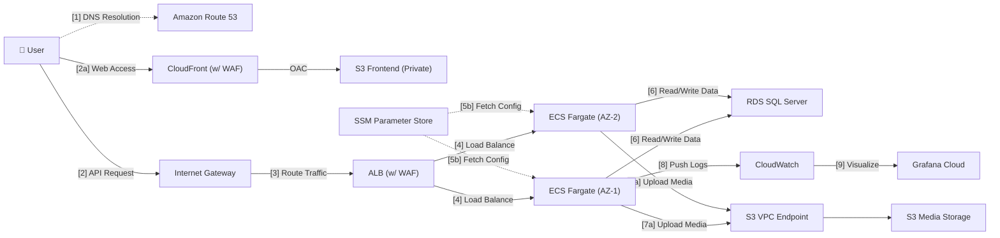
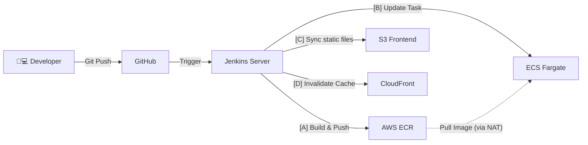

# Mini Social Network
## A Cloud-Native AWS Infrastructure with Automated CI/CD Pipelines

### 1. Executive Summary
The Mini Social Network (MiniSocial) is a production-grade academic project designed to demonstrate advanced DevOps and Cloud Engineering workflows. It supports a scalable, full-stack social platform, utilizing a cloud-native architecture to deliver high availability and security. The platform leverages AWS services to provide automated CI/CD pipelines, robust networking, and real-time monitoring, with access securely managed and delivered globally through CloudFront and WAF.

### 2. Problem Statement
**What’s the Problem?**
Building and deploying a modern full-stack application often requires addressing significant infrastructure complexities. Traditional environments lack streamlined, automated deployment pipelines, leading to manual errors and slow delivery. Furthermore, ensuring high availability, security against web attacks, and cost efficiency in a manual deployment model is highly difficult and resource-intensive.

**The Solution**
The platform uses AWS CloudFormation for Infrastructure as Code (IaC) to provision secure VPC networks and Amazon RDS. Jenkins pipelines automate the CI/CD process, building and pushing Docker images to Amazon ECR, and deploying the Spring Boot backend to Amazon ECS Fargate. The React frontend is hosted on Amazon S3 and distributed via Amazon CloudFront. AWS WAF protects the Application Load Balancer and CloudFront distributions from common web exploits. Similar to enterprise-grade architectures, this project ensures zero-downtime deployments and robust security, tailored for academic demonstration.

**Benefits and Return on Investment**
The solution establishes a foundational blueprint for engineers to understand and implement enterprise DevOps practices. It completely replaces manual deployment processes with automated Jenkins pipelines, saving significant time and reducing human error. Monthly infrastructure costs are heavily optimized to approximately $45.00 – $60.00 USD by utilizing ECS Fargate Spot and EventBridge Scheduler to power down environments during off-peak hours (saving ~37.5% runtime costs). The break-even value is achieved through immense time savings and the creation of a highly reusable CloudFormation template library.

### 3. Solution Architecture
The platform employs a serverless and containerized AWS architecture to manage user traffic and application logic. Data is stored in Amazon RDS for SQL Server, backend processing is handled by ECS Fargate, and the frontend is delivered via CloudFront. The architecture is detailed below:

#### 1. Main Request Flow (Data Flow)

#### 2. CI/CD Pipeline Flow

**AWS Services Used**
- **Amazon VPC & Networking:** Multi-AZ subnets, NAT Gateway, and S3 Gateway Endpoint for secure isolation.
- **Amazon ECS Fargate:** Serverless container execution for backend application nodes.
- **Amazon RDS for SQL Server:** Managed database service hosted in dedicated private subnets.
- **Amazon S3 & CloudFront:** Secure frontend hosting via OAC and global content delivery.
- **AWS WAF & ACM:** Enterprise-grade web application firewall protection and automated SSL/TLS certificates.
- **Amazon Route 53:** Highly available DNS management.
- **Amazon ECR & Jenkins:** Secure Docker registry and automated CI/CD pipelines.
- **Amazon CloudWatch & EventBridge:** System logging, infrastructure metrics, and automated scheduling.
- **AWS Systems Manager Parameter Store**: Secure storage and management of application configuration data and secrets.

**Component Design**
- **Frontend (Web Interface):** React application built with TypeScript, delivering the user interface through CloudFront.
- **Backend (API Layer):** Spring Boot application running in Docker containers on ECS Fargate, handling business logic.
- **Data Storage:** Amazon RDS for SQL Server serves as the primary relational database.
- **CI/CD Pipeline:** Jenkins servers orchestrate the build, test, and deployment phases using declarative Jenkinsfiles.
- **Security & Access:** AWS WAF inspects incoming traffic at the edge and at the ALB level to block malicious requests. 

### 4. Technical Implementation
**Implementation Phases** 
This project is structured into 5 distinct phases to seamlessly build the infrastructure and automate the deployments:

1. **Phase 1 – Foundation:** Provision networking resources (VPC, subnets, NAT Gateway) and Amazon RDS using AWS CloudFormation.
2. **Phase 2 – CI/CD Setup:** Configure the Jenkins server, credentials, pipelines, and deployment environment.
3. **Phase 3 – Backend Deployment & WAF:** Build Docker images, push to Amazon ECR, deploy Spring Boot to Amazon ECS Fargate, and secure the ALB with AWS WAF.
4. **Phase 4 – Frontend Deployment & WAF:** Deploy the React application to Amazon S3, distribute via CloudFront, and configure AWS WAF.
5. **Phase 5 – Monitoring & Optimization:** Collect logs and metrics using CloudWatch and Grafana Cloud, and load test the system.

**Technical Requirements**
- **Infrastructure:** AWS account with administrative access to provision VPC, RDS, ECS, S3, CloudFront, WAF, and Route 53.
- **DevOps Tools:** Local or cloud-hosted Jenkins server equipped with Docker, AWS CLI, Node.js, and Java environments.
- **Automation:** Practical knowledge of AWS CloudFormation for IaC and Jenkins Pipeline scripts (Jenkinsfile) for continuous delivery.

### 5. Timeline & Milestones
**Project Timeline**
The project spans a total of 12 weeks, moving from local development to a fully automated cloud production release:

- **Weeks 1-2:** Requirement analysis, system architecture design, and local Docker environment setup.
- **10 weeks of active implementation:**
  - **Weeks 3-5 (Development):** Build the core features (Authentication, Posts, Chat, Gamification) using Spring Boot and React.
  - **Weeks 6-8 (Infrastructure & CI/CD):** Provision AWS foundation resources via CloudFormation and establish Jenkins automation.
  - **Weeks 9-10 (Deployment):** Deploy the containerized backend to ECS Fargate and the frontend to S3/CloudFront.
  - **Weeks 11-12 (Security & Launch):** Enforce AWS WAF rules, map Route 53 domains, integrate CloudWatch/Grafana, execute load tests, and go live.
- **Post-Launch:** Continuous infrastructure cost optimization and system monitoring.

### 6. Budget Estimation
**Infrastructure Costs**
AWS Services (Estimated Monthly):
- **Amazon ECS Fargate:** ~$15.00 – $20.00/month (15h/day operation).
- **ECS Fargate Spot:** ~$3.00 – $5.00/month (Cost reduction auxiliary tasks).
- **Amazon RDS (db.t3.small):** ~$10.00 – $15.00/month (15h/day operation).
- **AWS NAT Gateway:** ~$5.00 – $8.00/month (Optimized via S3 Endpoint).
- **Application Load Balancer & AWS WAF:** ~$10.00/month.
- **Amazon S3, CloudFront, CloudWatch:** ~$2.00 – $4.00/month.
- **Total Estimated:** ~$45.00 – $60.00 / month.

### 7. Risk Assessment
**Risk Matrix**
- **Fargate Spot Reclamation:** Medium impact, medium probability.
- **Budget Overruns:** High impact, low probability.
- **Database Failure:** High impact, low probability.

**Mitigation Strategies**
- **Fargate Spot:** Maintain a minimum On-Demand base task (Base=1) that guarantees the primary node never drops.
- **Budget:** Use AWS EventBridge Scheduler to strictly shut down compute environments at night (10:00 PM to 7:00 AM).
- **Database:** Configure automated rolling backups and StorageEncrypted flags for RDS.

**Contingency Plans**
- If cloud costs unexpectedly spike, trigger automated alarms to freeze non-essential staging nodes.
- If Jenkins CI/CD fails, pipelines can be quickly migrated to GitHub Actions using the existing modular scripts.

### 8. Expected Outcomes
**Technical Improvements:**
- Fully automated CI/CD pipelines replace manual deployment processes.
- Enterprise-grade security via AWS WAF and private subnet isolation.

**Long-term Value:**
- A highly reusable, modular CloudFormation blueprint for future enterprise applications.
- A robust training environment for engineers transitioning to AWS Cloud-Native architectures.