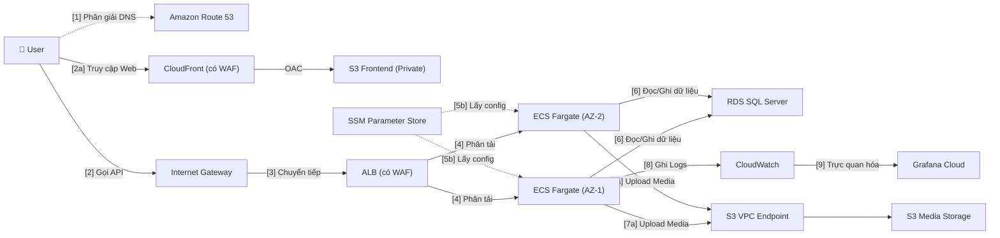
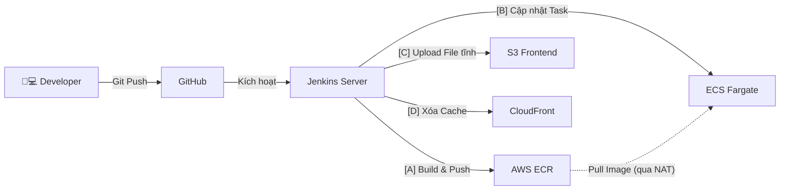

# Mạng Xã Hội Nội Bộ (Mini Social Network)
## Triển khai Hạ tầng Cloud-Native AWS với Kênh CI/CD Tự động

### 1. Tóm tắt dự án
Mini Social Network (MiniSocial) là một dự án học thuật thực chiến nhằm chứng minh năng lực chuyên sâu về DevOps và Cloud Engineering. Dự án hỗ trợ một nền tảng mạng xã hội full-stack có khả năng mở rộng, sử dụng kiến trúc cloud-native để mang lại tính sẵn sàng và độ bảo mật cao. Nền tảng tận dụng các dịch vụ AWS để cung cấp quy trình CI/CD tự động, mạng lưới nội bộ bảo mật, và hệ thống giám sát thời gian thực, với quyền truy cập được quản lý và phân phối toàn cầu thông qua CloudFront và WAF.

### 2. Định nghĩa bài toán 
**Vấn đề là gì?**
Việc xây dựng và triển khai một ứng dụng full-stack hiện đại thường gặp phải những phức tạp lớn về hạ tầng. Các môi trường truyền thống thiếu vắng các đường ống triển khai tự động, dẫn đến các thao tác thủ công dễ sai sót và chậm chạp. Hơn nữa, việc đảm bảo tính sẵn sàng cao, bảo mật chống lại các cuộc tấn công web, và tối ưu hóa chi phí trong mô hình triển khai thủ công là cực kỳ khó khăn và tốn kém tài nguyên.

**Giải pháp**
Nền tảng sử dụng AWS CloudFormation (IaC) để khởi tạo mạng VPC bảo mật và Amazon RDS. Các pipeline Jenkins sẽ tự động hóa quá trình CI/CD, build và push Docker images lên Amazon ECR, sau đó triển khai backend Spring Boot lên Amazon ECS Fargate. Frontend React được lưu trữ trên Amazon S3 và phân phối qua Amazon CloudFront. AWS WAF bảo vệ Application Load Balancer và CloudFront khỏi các lỗ hổng web phổ biến. Tương tự như các kiến trúc cấp doanh nghiệp, dự án này đảm bảo triển khai không gián đoạn (zero-downtime) và bảo mật tuyệt đối, được tối ưu cho mục đích học thuật.

**Lợi ích và Hiệu quả đầu tư**
Giải pháp tạo ra một bộ khuôn mẫu (blueprint) nềnảng để các kỹ sư học hỏi và áp dụng các thực tiễn DevOps doanh nghiệp. Dự án thay thế hoàn toàn quy trình triển khai thủ công bằng Jenkins pipeline tự động, tiết kiệm thời gian đáng kể và giảm thiểu sai sót do con người. Chi phí hạ tầng hàng tháng được tối ưu cực mạnh xuống còn khoảng $45.00 – $60.00 USD thông qua việc dùng ECS Fargate Spot và EventBridge Scheduler để tắt hạ tầng ngoài giờ cao điểm (tiết kiệm ~37.5% chi phí chạy máy). Giá trị hoàn vốn đạt được nhờ vào lượng lớn thời gian tiết kiệm được và việc sở hữu một thư viện CloudFormation IaC có khả năng tái sử dụng cao.

### 3. Kiến trúc giải pháp
Nền tảng sử dụng kiến trúc AWS serverless và container hóa để quản lý lưu lượng người dùng và logic ứng dụng. Dữ liệu được lưu trữ trong Amazon RDS cho SQL Server, xử lý backend được thực hiện bởi ECS Fargate, và frontend được phân phối qua CloudFront. Chi tiết kiến trúc như sau:

#### 1. Luồng Request chính

#### 2. Luồng CI/CD

**Các dịch vụ AWS được sử dụng**
- **Amazon VPC & Networking:** Multi-AZ subnets, NAT Gateway, và S3 Gateway Endpoint để cô lập mạng an toàn.
- **Amazon ECS Fargate:** Môi trường chạy container serverless cho các ứng dụng backend.
- **Amazon RDS cho SQL Server:** Dịch vụ cơ sở dữ liệu quản lý đặt trong subnet riêng biệt.
- **Amazon S3 & CloudFront:** Lưu trữ an toàn frontend qua OAC và phân phối nội dung toàn cầu.
- **AWS WAF & ACM:** Tường lửa bảo vệ ứng dụng web cấp doanh nghiệp và cấp phát chứng chỉ SSL/TLS tự động.
- **Amazon Route 53:** Quản lý DNS với tính sẵn sàng cao.
- **Amazon ECR & Jenkins:** Kho lưu trữ Docker bảo mật và hệ thống pipeline CI/CD tự động.
- **Amazon CloudWatch & EventBridge:** Thu thập log hệ thống, giám sát hạ tầng và lập lịch tự động.
- **AWS Systems Manager Parameter Store:** Lưu trữ và quản lý cấu hình ứng dụng và bí mật an toàn.

**Thiết kế thành phần**
- **Frontend (Giao diện Web):** Ứng dụng React được xây dựng bằng TypeScript, phân phối giao diện thông qua CloudFront.
- **Backend (Tầng API):** Ứng dụng Spring Boot chạy trong các Docker container trên ECS Fargate để xử lý logic nghiệp vụ.
- **Lưu trữ Dữ liệu:** Amazon RDS cho SQL Server đóng vai trò là cơ sở dữ liệu quan hệ chính.
- **CI/CD Pipeline:** Máy chủ Jenkins điều phối quá trình build, test, và triển khai sử dụng kịch bản Jenkinsfile.
- **Bảo mật & Truy cập:** AWS WAF kiểm tra lưu lượng truy cập từ ngoài rìa mạng (edge) và tại ALB để chặn các request độc hại.

### 4. Triển khai kỹ thuật 
**Các giai đoạn triển khai**
Dự án được chia thành 5 giai đoạn rõ rệt để xây dựng hạ tầng và tự động hóa triển khai một cách mượt mà:

1. **Giai đoạn 1 – Hạ tầng cơ sở:** Khởi tạo tài nguyên mạng (VPC, subnets, NAT Gateway) và Amazon RDS bằng AWS CloudFormation.
2. **Giai đoạn 2 – Thiết lập CI/CD:** Cấu hình máy chủ Jenkins, thông tin xác thực, pipelines, và môi trường triển khai.
3. **Giai đoạn 3 – Triển khai Backend & WAF:** Build Docker image, đẩy lên Amazon ECR, triển khai Spring Boot lên Amazon ECS Fargate, và bảo vệ ALB bằng AWS WAF.
4. **Giai đoạn 4 – Triển khai Frontend & WAF:** Triển khai ứng dụng React lên Amazon S3, phân phối qua CloudFront, và cấu hình AWS WAF.
5. **Giai đoạn 5 – Giám sát & Tối ưu hóa:** Thu thập logs và metrics sử dụng CloudWatch và Grafana Cloud, đồng thời kiểm thử tải hệ thống.

**Yêu cầu kỹ thuật**
- **Hạ tầng:** Tài khoản AWS với quyền admin để khởi tạo VPC, RDS, ECS, S3, CloudFront, WAF, và Route 53.
- **Công cụ DevOps:** Máy chủ Jenkins (local hoặc cloud) có cài đặt Docker, AWS CLI, Node.js, và môi trường Java.
- **Tự động hóa:** Kiến thức thực tiễn về AWS CloudFormation (IaC) và kịch bản Jenkins Pipeline (Jenkinsfile) phục vụ phân phối liên tục.

### 5. Lịch trình & Các cột mốc
**Lịch trình dự án**
Dự án được triển khai xuyên suốt trong 12 tuần, bắt đầu từ việc phát triển local cho đến khi hệ thống vận hành hoàn toàn tự động trên Cloud:

- **Tuần 1-2** Phân tích yêu cầu, thiết kế kiến trúc hệ thống và thiết lập môi trường Docker local.
- **10 tuần thực thi cốt lõi:**
  - **Tuần 3-5 (Phát triển phần mềm):** Xây dựng các tính năng cốt lõi (Xác thực, Bài đăng, Chat, Gamification) bằng Spring Boot và React.
  - **Tuần 6-8 (Hạ tầng & CI/CD):** Khởi tạo tài nguyên mạng AWS qua CloudFormation và thiết lập tự động hóa Jenkins.
  - **Tuần 9-10 (Triển khai):** Triển khai backend lên ECS Fargate và phân phối frontend qua S3/CloudFront.
  - **Tuần 11-12 (Bảo mật & Ra mắt):** Cấu hình bảo mật AWS WAF, gắn tên miền Route 53, tích hợp giám sát CloudWatch/Grafana, kiểm thử tải và ra mắt.
- **Hậu ra mắt:** Liên tục giám sát hệ thống và tối ưu hóa chi phí hạ tầng.

### 6. Ước tính ngân sách
**Chi phí hạ tầng**
Dịch vụ AWS (Ước tính hàng tháng):
- **Amazon ECS Fargate:** ~$15.00 – $20.00/tháng (Hoạt động 15h/ngày).
- **ECS Fargate Spot:** ~$3.00 – $5.00/tháng (Các task dự phòng giảm chi phí).
- **Amazon RDS (db.t3.small):** ~$10.00 – $15.00/tháng (Hoạt động 15h/ngày).
- **AWS NAT Gateway:** ~$5.00 – $8.00/tháng (Tối ưu thông qua S3 Endpoint).
- **Application Load Balancer & AWS WAF:** ~$10.00/tháng.
- **Amazon S3, CloudFront, CloudWatch:** ~$2.00 – $4.00/tháng.
- **Tổng ước tính:** ~$45.00 – $60.00 / tháng.

### 7. Đánh giá rủi ro 
**Ma trận rủi ro**
- **Fargate Spot bị thu hồi:** Tác động trung bình, xác suất trung bình.
- **Vượt ngân sách chi phí:** Tác động cao, xác suất thấp.
- **Sự cố Cơ sở dữ liệu:** Tác động cao, xác suất thấp.

**Chiến lược giảm thiểu rủi ro**
- **Fargate Spot:** Duy trì tối thiểu một task On-Demand cơ bản (Base=1) để đảm bảo node chính không bao giờ bị sập.
- **Chi phí:** Sử dụng AWS EventBridge Scheduler để tắt nghiêm ngặt các môi trường máy tính vào ban đêm (22:00 đến 07:00).
- **Cơ sở dữ liệu:** Cấu hình sao lưu tự động và bật cờ StorageEncrypted cho RDS.

**Kế hoạch dự phòng**
- Nếu chi phí cloud tăng đột biến ngoài dự kiến, tự động kích hoạt cảnh báo để đóng băng các node không thiết yếu.
- Nếu hệ thống CI/CD Jenkins bị lỗi, các pipelines có thể được nhanh chóng chuyển đổi sang GitHub Actions nhờ sử dụng các kịch bản module hóa.

### 8. Kết quả kỳ vọng
**Cải tiến kỹ thuật**
- Quy trình CI/CD tự động thay thế hoàn toàn các bước triển khai thủ công.
- Đạt mức bảo mật cấp doanh nghiệp thông qua AWS WAF và cơ chế cô lập mạng Private Subnet.

**Giá trị lâu dài**
- Sở hữu một bộ CloudFormation blueprint dạng module hóa, tái sử dụng cao cho các ứng dụng tương lai.
- Tạo ra một môi trường đào tạo mạnh mẽ cho các kỹ sư đang chuyển đổi sang kiến trúc Cloud-Native trên AWS.